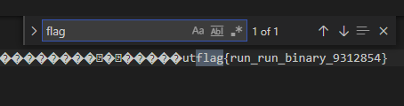
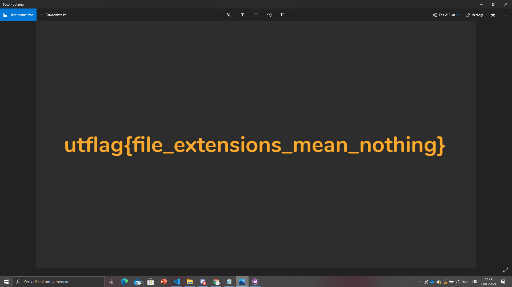
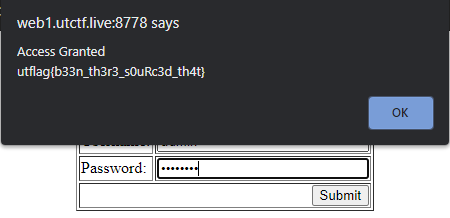

 </a>

<h3 align="center">Capture_The_Flag By_M._Mikail_Dwi_K.</h3>

  
  
  

<!--    -->

---

💡 Perlindungan Waf yang kami ambil disini adalah Modsecurity, dan melakukan integrasi pada bot Discord.

## Table of Contents

- [Dependency](#dependency)
- [Membuat & Masuk VM](#setup_azure)
- [Installasi Modsecurity](#install_modsec)
- [Konfigurasi Modsecurity](#conf_modsec)
- [Pengujian Modsecurity](#uji_modsec)
- [Screenshoot](#ss)

# UTCTF 
## Beginner
### Title :Sanity Check
Point : 5
Desc  :
Please join the contest Discord server so you can get updates about hints, status updates, and more.
You'll find the flag in the description of the #announcements channel!
(You must agree to the UTCTF Discord rules to see the #announcements channel)

Cara menemukan flag:
cukup pergi ke discord server, menuju #announcements, lalu pada deskripsi announcement terdapat flagnya.

### Title :HTML
Point : 912
Desc  :
I hid a flag somewhere in the code of the UTCTF website, can you find it?

Cara menemukan flag:
cukup menuju website UTCTF [bagian ini](https://www.isss.io/utctf/) lalu saya menggunakan browser google chrome, untuk browser yang lain mungkin tampilannya berbeda, lalu tekan f12 untuk membuka element dari websitenya, dan temukan flagnya dengan mencari kontennya (Ctrl + F) : flag.

### Title :Stringy Things
Point : 922
Desc  :
I know there's a string in this binary somewhere.... Now where did I leave it?
[Attachment](file/calc)
Cara menemukan flag:
buka file menggunakan pembaca file, disini saya menggunakan visual code, lalu cari flag

### Title :Run-ELF
Point : 924
Desc  :
Anyone know how to run an ELF file? I bet you could figure it out.
[Attachment](file/run)
Cara menemukan flag:
buka file menggunakan pembaca file, disini saya menggunakan visual code, lalu cari flag

### Title :Magic Bytes
Point : 926
Desc  :
My friend sent me this text file and said they put a flag inside. I opened it and it doesn't look like a normal text file to me! Maybe you'll be able to find it.
[Attachment](file/out.txt)
Cara menemukan flag:
ubah extensi file dari txt menjadi PNG, karena jika anda membuka txt nya, maka akan muncul tulisan PNG, itu berarti diberikan clue bahwa file tersebut seharusnya png

### Title :Cipher Gauntlet
Point : 934
Desc  :
Can you make it through all of the encodings and ciphers?
[Attachment](file/secret.txt)
Cara menemukan flag:
pertama translate file secret menggunakan binary akan muncul kalimat seperti ini:
Uh-oh, looks like we have another block of text, with some sort of special encoding. Can you figure out what this encoding is? (hint: if you look carefully, you'll notice that there only characters present are A-Z, a-z, 0-9, and sometimes / and +. See if you can find an encoding that looks like this one.)
TmV3IGNoYWxsZW5nZSEgQ2FuIHlvdSBmaWd1cmUgb3V0IHdoYXQncyBnb2luZyBvbiBoZXJlPyBJdCBsb29rcyBsaWtlIHRoZSBsZXR0ZXJzIGFyZSBzaGlmdGVkIGJ5IHNvbWUgY29uc3RhbnQuIChoaW50OiB5b3UgbWlnaHQgd2FudCB0byBzdGFydCBsb29raW5nIHVwIFJvbWFuIHBlb3BsZSkuCm15eHFia2Rldmtkc3l4YyEgaXllIHJrZm8gcHN4c2Nyb24gZHJvIGxvcXN4eG9iIG1iaXpkeXFia3pyaSBtcmt2dm94cW8uIHJvYm8gc2MgayBwdmtxIHB5YiBrdnYgaXllYiBya2JuIG9wcHliZGM6IGVkcHZrcXt4eWdfaXllYm9fenZraXN4cV9nc2RyX21iaXpkeX0uIGl5ZSBnc3Z2IHBzeG4gZHJrZCBrIHZ5ZCB5cCBtYml6ZHlxYmt6cmkgc2MgbGVzdm5zeHEgeXBwIGRyc2MgY3liZCB5cCBsa2NzbSB1eHlndm9ucW8sIGt4biBzZCBib2t2dmkgc2MgeHlkIGN5IGxrbiBrcGRvYiBrdnYuIHJ5em8gaXllIG94dHlpb24gZHJvIG1ya3Z2b3hxbyE=

Karena enkripsi berakhiran dengan sama dengan, maka enkripsi tersebut adalah enkripsi base64, lalu setelah di terjemahkan akan mendapat pesan seperti ini:
New challenge! Can you figure out what's going on here? It looks like the letters are shifted by some constant. (hint: you might want to start looking up Roman people).
myxqbkdevkdsyxc! iye rkfo psxscron dro loqsxxob mbizdyqbkzri mrkvvoxqo. robo sc k pvkq pyb kvv iyeb rkbn oppybdc: edpvkq{xyg_iyebo_zvkisxq_gsdr_mbizdy}. iye gsvv psxn drkd k vyd yp mbizdyqbkzri sc lesvnsxq ypp drsc cybd yp lkcsm uxygvonqo, kxn sd bokvvi sc xyd cy lkn kpdob kvv. ryzo iye oxtyion dro mrkvvoxqo!

lalu dekripsi menggunakan caesar cypher +10:
ongratulations! you have finished the beginner cryptography challenge. here is a flag for all your hard efforts: utflag{now_youre_playing_with_crypto}. you will find that a lot of cryptography is building off this sort of basic knowledge, and it really is not so bad after all. hope you enjoyed the challenge!

### Title :Sizzling Bacon
Point : 952
Desc  :
My buddy Francis is really into Bacon. He loves it so much that he gave me this encoded bacon-themed flag (he said he was inspired by the sound of sizzling bacon).

sSsSSsSSssSSsSsSsSssSSSSSSSssS{SSSsSsSSSsSsSSSsSSsSSssssssSSSSSSSsSSSSSSSSsSSsssSSssSsSSSsSSsSSSSssssSSsssSSsSSsSSSs}

Cara menemukan flag:
sesuai clue yang diberikan, ini adalah bacon cypher, gunakan decryptor lalu akan muncul seperti ini:
UTFLAGCRISPYBACONCIPHER
lalu sesuaikan, dengan kalimat enkripsi diatas yang menggunakan kurung kurawal maka jadi:
UTFLAG{CRISPYBACONCIPHER}

## WEB
### Title :Source it
Point : 912
Desc  :
Can you see how this page handles authentication?
http://web1.utctf.live:8778

Cara menemukan flag:
buka source pagenya, lalu terlihat bahwa usernamenya adalah admin dan passwordnya terhash dengan MD5 dengan enkripsi sebagai berikut:
1bea3a3d4bc3be1149a75b33fb8d82bc
jika di dekript maka akan menjadi: sherlock
lalu masukkan dan dapat flag
utflag{b33n_th3r3_s0uRc3d_th4t}

